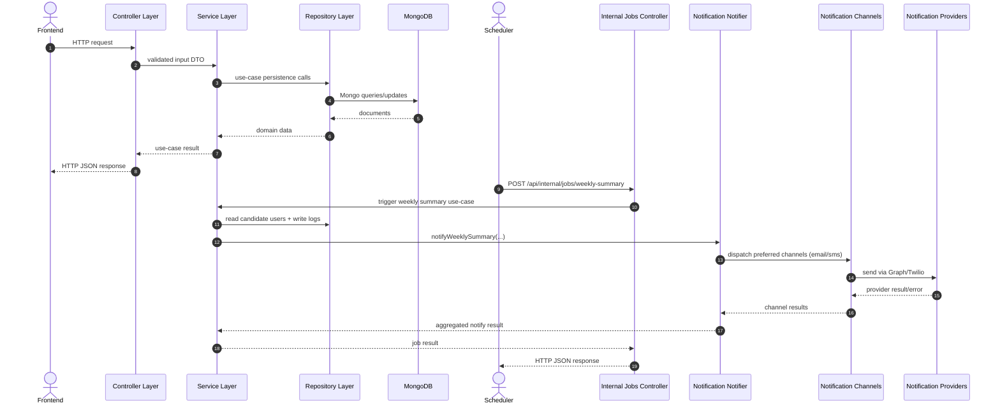

# Architecture Overview

## 1. Architectural Style

Avenu backend follows a layered architecture (not MVC) inside the backend container.

Layer order and dependency direction:

1. `app.py` (composition root)
2. `controllers/` (HTTP boundary)
3. `services/` (use-case orchestration)
4. `repositories/` (persistence boundary)
5. `models/` (domain entities/builders)

Allowed direction is one-way only: `app.py -> controllers -> services -> repositories -> models`.
No cross-layer shortcuts are permitted.

## 2. Deployment Topology (Unchanged)

Runtime topology remains unchanged:

- Frontend container (`frontend`)
- Backend container (`backend`)
- Scheduler container (`scheduler`)
- Database container (`database`)

Backend layering is internal to the backend container only and does not alter Docker topology.

## 3. Communication Boundaries

Allowed communication paths:

- Frontend -> Backend (HTTP)
- Scheduler -> Backend (HTTP)
- Backend -> Database
- Backend -> Optix
- Backend -> Email Provider
- Backend -> SMS Provider
- Backend -> OCR Provider

Disallowed paths:

- Frontend -> Database
- Scheduler -> Database
- Frontend -> External providers
- Scheduler -> External providers

## 4. Internal Layer Interaction Sequence

Canonical sequence diagram source:

- `docs/architecture/diagrams/internal-layer-interaction-sequence.mmd`

## 5. Internal Docker DNS Model

Within the compose network, service DNS names are:

- `frontend`
- `backend`
- `scheduler`
- `database`

Scheduler reaches backend at `http://backend:8000`.

## 6. Quality Constraint Alignment

QA-M1 remains satisfied: provider swaps (for example OCR/email/sms) stay isolated to provider abstractions and service wiring, without requiring changes to repository persistence flows or domain entities.

## 7. Design Constraints

- No combined monolithic application container.
- No internal reverse-proxy routing inside application containers.
- Inter-service app communication uses explicit HTTP boundaries.
- Secrets/configuration come from environment variables, not image-embedded values.
